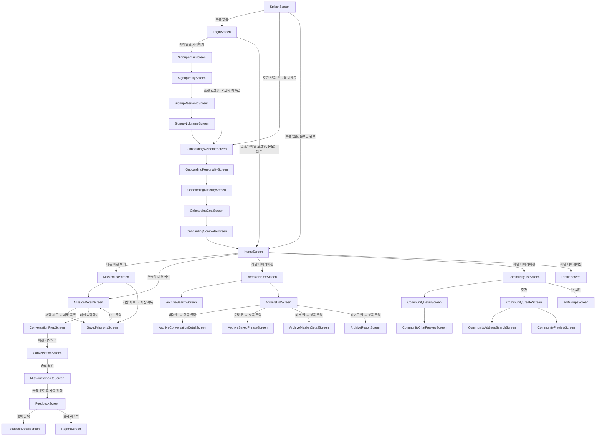

# 화면 목록 & 내비게이션 플로우

스크린 ID 네이밍 규칙은 [`CONVENTIONS.md`](CONVENTIONS.md)의 "6. 화면 네이밍 규칙" 참고.

> **집계 기준**: 피그마 와이어프레임에는 **화면 크기 프레임 54개 + 팝업 4개**가 있습니다. 이 중 같은 화면의 상태 변형(예: `홈 화면(미션 상세)`가 2개, `대화 진행(기본)`이 2개)은 하나의 Screen으로 구현하므로, **실제 구현 대상은 논리 화면 35개 + 팝업 4개**입니다. 아래 표의 "와이어프레임 대응" 칸에 각 Screen이 어떤 프레임에서 왔는지 적어두었습니다.

---

## 화면 목록

### A담당 (지니/전준호) — 진입 · 프로필 (12개)

| 화면 이름 | 스크린 ID | 진입 경로 | 와이어프레임 대응 |
| --- | --- | --- | --- |
| 스플래시 | SplashScreen | 앱 최초 실행 | 스플래시 |
| 로그인 | LoginScreen | 스플래시 종료 후 (토큰 없음) | 로그인, 이메일로 로그인(회원가입)〔계정 연동 팝업 상태〕 |
| 이메일 회원가입 | SignupEmailScreen | 로그인 화면 → 이메일로 시작하기 | 회원가입(이메일) |
| 이메일 인증 | SignupVerifyScreen | 이메일 입력 → 전송 | 회원가입(이메일 인증) |
| 비밀번호 설정 | SignupPasswordScreen | 이메일 인증 완료 후 | 회원가입(비밀번호 설정) |
| 닉네임 설정 | SignupNicknameScreen | 비밀번호 설정 후 | 통합 로그인(닉네임 설정) |
| 온보딩 환영 | OnboardingWelcomeScreen | 회원가입 완료 / 최초 로그인 시 | 온보딩(가입 완료 애니메이션) |
| 온보딩 성향 선택 | OnboardingPersonalityScreen | 온보딩 환영 → 다음 | 온보딩(성향) |
| 온보딩 어려운 상황 | OnboardingDifficultyScreen | 성향 선택 → 다음 | 온보딩(상황) |
| 온보딩 연습 목표 | OnboardingGoalScreen | 어려운 상황 선택 → 다음 | 온보딩(연습 선호도) |
| **온보딩 완료** | **OnboardingCompleteScreen** | 연습 목표 설정 → 완료 | 온보딩(완료 애니메이션) |
| 프로필 | ProfileScreen | 하단 네비게이션 '프로필' 탭 | 프로필(메인) |

> **온보딩 두 애니메이션 프레임 구분**: `온보딩(가입 완료 애니메이션)` = 회원가입 직후 환영 화면(→ `OnboardingWelcomeScreen`, "반가워요, @@님!"), `온보딩(완료 애니메이션)` = 온보딩 전체를 마친 완료 화면(→ `OnboardingCompleteScreen`). 좌표 순서(left 3510 → 5687)와 "반가워요" 텍스트 위치로 확인됨.

### B담당 (이도/윤기수) — 미션 · AI 대화 · 성장 리포트 (11개)

| 화면 이름 | 스크린 ID | 진입 경로 | 와이어프레임 대응 |
| --- | --- | --- | --- |
| 홈 | HomeScreen | 로그인/온보딩 완료 후, 하단 네비게이션 '홈' 탭 | 홈 화면(메인) |
| 미션 목록 | MissionListScreen | 홈 → 다른 미션 보기 | 홈 화면(미션 목록) |
| 미션 상세 | MissionDetailScreen | 홈 카드 또는 미션 목록 → 카드 클릭 | 홈 화면(미션 상세)×2, 미션 상세-북마크 / 북마크 올렸을 때〔저장 상태〕 |
| 저장 목록 | SavedMissionsScreen | 미션 목록·상세의 저장 시트 → "저장 목록 >" | 미션 상세-북마크 목록〔저장한 미션 목록·상태 필터〕 |
| 대화 준비 | ConversationPrepScreen | 미션 상세 → 미션 시작하기 | 홈 화면(미션 진입) |
| 대화하기 | ConversationScreen | 대화 준비 → 미션 시작하기 | 대화 진행(기본)×2, 대화 진행(뒤로가기)〔나가기 팝업 상태〕 |
| 대화 완료 | ConversationCompleteScreen | *(현재 미구현 — 대화 종료 시 미션 완료로 바로 이동)* | 대화 완료 |
| **미션 완료·XP** | **MissionCompleteScreen** | 대화하기 → 종료 확인 | 미션 완료 & XP 획득 |
| AI 피드백 요약 | FeedbackScreen | 미션 완료 → (연출 종료 후) 자동 전환 | AI 피드백 |
| AI 피드백 상세 | FeedbackDetailScreen | 피드백 요약 → 항목 클릭 | AI 피드백 상세 |
| 성장 리포트 | ReportScreen | AI 피드백 요약 → "상세 리포트" | 성장 리포트, 주간 비교 리포트〔같은 탭바 공유 → 1화면 2탭〕, 리포트 저장〔저장 시트 상태〕 |

> **`저장 목록`(SavedMissionsScreen)은 원래 미션 상세의 "북마크 목록" 상태였으나, 저장 시트에서 진입하는 독립 화면으로 분리해 구현했습니다.** 상태 필터(완료/진행중/미완료)로 저장한 미션을 모아 봅니다.
>
> **`대화 완료`(대화 요약)는 UI 시안(v3)에 별도 프레임이 없어 만들지 않았고, 대화 진행에서 종료 확인 시 `미션 완료·XP`로 바로 이동합니다.** route 상수(`CONVERSATION_COMPLETE`)만 남겨둔 상태이며, 나중에 대화 요약 화면이 필요해지면 그 사이에 끼워 넣습니다.
>
> **`미션 완료·XP` → `AI 피드백 요약`은 완료 연출이 끝나면 자동으로 전환됩니다(피그마 프로토타입 의도). 연출 중 화면을 터치하면 남은 연출을 마친 뒤 즉시 넘어갑니다.**
>
> **`성장 리포트`(ReportScreen)** — 성장 리포트 / 주간 비교 리포트가 피그마에서 **같은 탭바를 공유**하는 탭 전환 관계라 **하나의 Screen + 탭 상태**로 구현합니다(route: `Screen.REPORT`). UI는 이미 구현돼 있고(`feature/report`), AI 피드백 요약의 "상세 리포트"에서 진입합니다. 현재는 stub 데이터로 그려지며, "리포트 저장하기" 버튼은 아카이브 API 연동 전이라 동작 TODO 상태입니다.
>
> **B의 성장 리포트 담당 범위 = `ReportScreen` 화면 자체 + "리포트 저장하기"로 올라오는 저장 시트까지입니다.** 아카이브에서 리포트로 들어가는 경로(`OO(보관함에서 진입)` 프레임들)와 그 화면들은 **C 담당**입니다.

### C담당 (훈/김재훈) — 아카이브 · 커뮤니티 (14개)

| 화면 이름 | 스크린 ID | 진입 경로 | 와이어프레임 대응 |
| --- | --- | --- | --- |
| 아카이브 홈 | ArchiveHomeScreen | 하단 네비게이션 '아카이브' 탭 | 아카이브(메인) |
| 아카이브 검색/필터 | ArchiveSearchScreen | 아카이브 홈 → 검색 아이콘 | 검색, 검색 결과-정렬 선택〔결과 상태〕 |
| 아카이브 목록 | ArchiveListScreen | 아카이브 홈 → 카테고리 선택 | 아카이브(완료한 미션/대화/문장/리포트 선택시)〔4탭〕, 보관함(미션/대화/문장/리포트) |
| 대화 기록 상세 | ArchiveConversationDetailScreen | 아카이브 목록 → 대화 기록 항목 클릭 | 아카이브(대화 상세), 대화(보관함에서 진입), 대화-다시보기 |
| 저장한 문장 상세 | ArchiveSavedPhraseScreen | 아카이브 목록 → 저장한 문장 항목 클릭 | 아카이브(문장 상세), 문장(보관함에서 진입) |
| **보관함 미션 상세** | **ArchiveMissionDetailScreen** | 아카이브 목록 → 미션 항목 클릭 | 미션(보관함에서 진입)=미션 상세(재시작 가능) |
| **보관함 리포트** | **ArchiveReportScreen** | 아카이브 목록 → 리포트 항목 클릭 | 성장 리포트(보관함에서 진입), 주간 비교 리포트(보관함에서 진입) |
| 커뮤니티 목록 | CommunityListScreen | 하단 네비게이션 '모임' 탭 | 모임(메인), 모임(검색 결과)〔검색 상태〕 |
| 커뮤니티 상세 | CommunityDetailScreen | 커뮤니티 목록 → 카드 클릭 | 모임(상세)×2〔기본/승인 대기〕, 모임(저장시 팝업)〔저장 상태〕, 모임(신청 완료)〔신청 상태〕 |
| **채팅방 미리보기** | **CommunityChatPreviewScreen** | 커뮤니티 상세 → 채팅방 미리보기 | 모임(채팅창 미리보기) |
| 모임 만들기 | CommunityCreateScreen | 커뮤니티 목록 → 추가 버튼 | 모임(만들기) |
| **주소 검색** | **CommunityAddressSearchScreen** | 모임 만들기 → 지역/장소 입력 | 모임(주소 검색 및 선택) |
| 모임 미리보기/게시 | CommunityPreviewScreen | 모임 만들기 → 다음 | 모임(만들기-미리보기) |
| 내 모임 | MyGroupsScreen | 커뮤니티 목록 → 내 모임 | 내 모임(참여중)×2, 내 모임(내가 만든), 내 모임(북마크)〔3탭〕 |

> 이전 `ArchiveMissionListScreen`은 실제 와이어프레임에서 **미션/대화/문장/리포트 4개 탭을 가진 하나의 목록 화면**이라 `ArchiveListScreen`으로 정리했습니다. (완료한 미션만 보는 화면이 아님)
>
> **아카이브에서 진입하는 상세 화면(`OO(보관함에서 진입)` 프레임들)은 전부 C 담당입니다.** UI 5차에서 미션 상세(재시작 가능)·리포트 2종이 아카이브 전용 프레임으로 추가됐습니다. 미션 상세·리포트가 B의 화면과 비슷해 보여도 **아카이브 흐름의 화면이므로 C가 만듭니다.** B의 `MissionDetailScreen`/`ReportScreen` 컴포넌트를 재사용하고 싶으면 B에게 요청하세요(공통화는 그때 논의).

> **역할 분담 갱신(2026-07): 커뮤니티가 부가 기능이라 피그마 디자인이 뒤로 밀리면서 재분배함** — 아카이브가 A→C로, 성장 리포트가 C→B로 이동. (원래: A 진입·아카이브·프로필 / B 미션·AI 대화 / C 커뮤니티·성장 리포트)

---

## 팝업 (4개)

화면 크기가 아닌 작은 모달 상자입니다. 별도 Screen이 아니라 해당 화면 위에 띄우는 다이얼로그로 구현합니다.

| 팝업 이름 | 뜨는 위치 | 담당 |
| --- | --- | --- |
| 이탈 팝업 | 모임 만들기 중 뒤로가기 ("아직 작성 중인 내용이 있어요") | C (훈/김재훈) |
| 게시 완료 팝업 | 모임 게시 완료 ("모임이 게시되었어요") | C (훈/김재훈) |
| 탈퇴 팝업(승인된 상태) | 내 모임 → 나가기 (승인 완료 모임) | C (훈/김재훈) |
| 탈퇴 팝업(승인 대기 상태) | 내 모임 → 나가기 (승인 대기 모임) | C (훈/김재훈) |

> 이 외에 **화면 안에 포함된 팝업/시트**(별도 프레임 아님)도 있습니다: 로그인의 `계정 연동 팝업`, 대화하기의 `나가기 확인 팝업`, 커뮤니티 상세의 `모임 저장 시트`. 이들은 각 Screen 내부 상태로 처리합니다.

---

## 내비게이션 플로우

