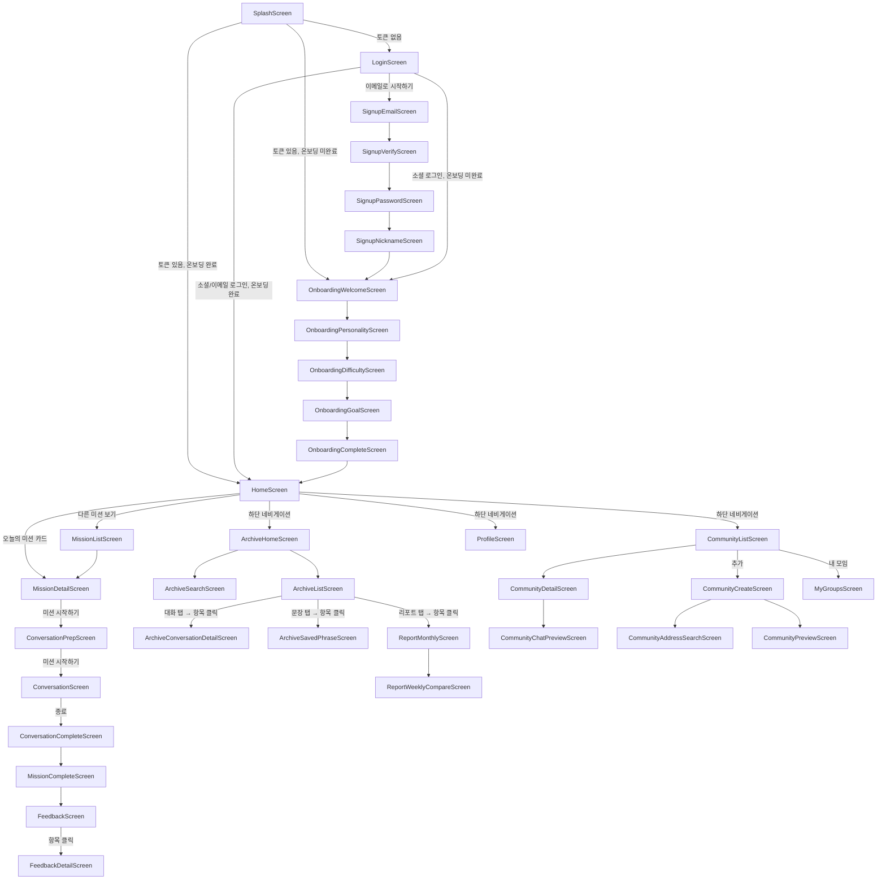

# 화면 목록 & 내비게이션 플로우

스크린 ID 네이밍 규칙은 [`CONVENTIONS.md`](CONVENTIONS.md)의 "6. 화면 네이밍 규칙" 참고.

> **집계 기준**: 피그마 와이어프레임에는 **화면 크기 프레임 54개 + 팝업 4개**가 있습니다. 이 중 같은 화면의 상태 변형(예: `홈 화면(미션 상세)`가 2개, `대화 진행(기본)`이 2개)은 하나의 Screen으로 구현하므로, **실제 구현 대상은 논리 화면 35개 + 팝업 4개**입니다. 아래 표의 "와이어프레임 대응" 칸에 각 Screen이 어떤 프레임에서 왔는지 적어두었습니다.

---

## 화면 목록

### A담당 (지니/전준호) — 진입 · 아카이브 · 프로필 (17개)

| 화면 이름 | 스크린 ID | 진입 경로 | 와이어프레임 대응 |
| --- | --- | --- | --- |
| 스플래시 | SplashScreen | 앱 최초 실행 | 스플래시 |
| 로그인 | LoginScreen | 스플래시 종료 후 (토큰 없음) | 로그인, 이메일로 로그인(회원가입)〔계정 연동 팝업 상태〕 |
| 이메일 회원가입 | SignupEmailScreen | 로그인 화면 → 이메일로 시작하기 | 회원가입(이메일) |
| 이메일 인증 | SignupVerifyScreen | 이메일 입력 → 전송 | 회원가입(이메일 인증) |
| 비밀번호 설정 | SignupPasswordScreen | 이메일 인증 완료 후 | 회원가입(비밀번호 설정) |
| 닉네임 설정 | SignupNicknameScreen | 비밀번호 설정 후 | 통합 로그인(닉네임 설정) |
| 온보딩 환영 | OnboardingWelcomeScreen | 회원가입 완료 / 최초 로그인 시 | 온보딩(가입 완료 애니메이션) |
| 온보딩 성향 선택 | OnboardingPersonalityScreen | 온보딩 환영 → 다음 | 온보딩(성향) |
| 온보딩 어려운 상황 | OnboardingDifficultyScreen | 성향 선택 → 다음 | 온보딩(상황) |
| 온보딩 연습 목표 | OnboardingGoalScreen | 어려운 상황 선택 → 다음 | 온보딩(연습 선호도) |
| **온보딩 완료** | **OnboardingCompleteScreen** | 연습 목표 설정 → 완료 | 온보딩(완료 애니메이션) |
| 아카이브 홈 | ArchiveHomeScreen | 하단 네비게이션 '아카이브' 탭 | 아카이브(메인) |
| 아카이브 검색/필터 | ArchiveSearchScreen | 아카이브 홈 → 검색 아이콘 | 검색, 검색 결과〔결과 상태〕 |
| 아카이브 목록 | ArchiveListScreen | 아카이브 홈 → 카테고리 선택 | 아카이브(완료한 미션/대화/문장/리포트 선택시)〔4탭〕 |
| 대화 기록 상세 | ArchiveConversationDetailScreen | 아카이브 목록 → 대화 기록 항목 클릭 | 아카이브(대화 상세) |
| 저장한 문장 상세 | ArchiveSavedPhraseScreen | 아카이브 목록 → 저장한 문장 항목 클릭 | 아카이브(문장 상세) |
| 프로필 | ProfileScreen | 하단 네비게이션 '프로필' 탭 | 프로필(메인) |

> 이전 `ArchiveMissionListScreen`은 실제 와이어프레임에서 **미션/대화/문장/리포트 4개 탭을 가진 하나의 목록 화면**이라 `ArchiveListScreen`으로 정리했습니다. (완료한 미션만 보는 화면이 아님)

> **온보딩 두 애니메이션 프레임 구분**: `온보딩(가입 완료 애니메이션)` = 회원가입 직후 환영 화면(→ `OnboardingWelcomeScreen`, "반가워요, @@님!"), `온보딩(완료 애니메이션)` = 온보딩 전체를 마친 완료 화면(→ `OnboardingCompleteScreen`). 좌표 순서(left 3510 → 5687)와 "반가워요" 텍스트 위치로 확인됨.

### B담당 (이도/윤기수) — 미션 · AI 대화 (9개)

| 화면 이름 | 스크린 ID | 진입 경로 | 와이어프레임 대응 |
| --- | --- | --- | --- |
| 홈 | HomeScreen | 로그인/온보딩 완료 후, 하단 네비게이션 '홈' 탭 | 홈 화면(메인) |
| 미션 목록 | MissionListScreen | 홈 → 다른 미션 보기 | 홈 화면(미션 목록) |
| 미션 상세 | MissionDetailScreen | 홈 카드 또는 미션 목록 → 카드 클릭 | 홈 화면(미션 상세)×2, 미션 상세-북마크 / 북마크 올렸을 때 / 북마크 목록〔저장 상태〕 |
| 대화 준비 | ConversationPrepScreen | 미션 상세 → 미션 시작하기 | 홈 화면(미션 진입) |
| 대화하기 | ConversationScreen | 대화 준비 → 미션 시작하기 | 대화 진행(기본)×2, 대화 진행(뒤로가기)〔나가기 팝업 상태〕 |
| 대화 완료 | ConversationCompleteScreen | 대화하기 → 종료 확인 | 대화 완료 |
| **미션 완료·XP** | **MissionCompleteScreen** | 대화 완료 → 다음 | 미션 완료 & XP 획득 |
| AI 피드백 요약 | FeedbackScreen | 미션 완료 → 다음 | AI 피드백 |
| AI 피드백 상세 | FeedbackDetailScreen | 피드백 요약 → 항목 클릭 | AI 피드백 상세 |

> `대화 완료`(대화 요약)와 `미션 완료 & XP 획득`(XP 지급 애니메이션)은 와이어프레임상 별개 프레임이라 두 화면으로 나눴습니다. 팀 상황에 따라 한 화면의 연속 스텝으로 합쳐도 됩니다.

### C담당 (훈/김재훈) — 커뮤니티 · 성장 리포트 (9개)

| 화면 이름 | 스크린 ID | 진입 경로 | 와이어프레임 대응 |
| --- | --- | --- | --- |
| 커뮤니티 목록 | CommunityListScreen | 하단 네비게이션 '모임' 탭 | 모임(메인), 모임(검색 결과)〔검색 상태〕 |
| 커뮤니티 상세 | CommunityDetailScreen | 커뮤니티 목록 → 카드 클릭 | 모임(상세)×2〔기본/승인 대기〕, 모임(저장시 팝업)〔저장 상태〕, 모임(신청 완료)〔신청 상태〕 |
| **채팅방 미리보기** | **CommunityChatPreviewScreen** | 커뮤니티 상세 → 채팅방 미리보기 | 모임(채팅창 미리보기) |
| 모임 만들기 | CommunityCreateScreen | 커뮤니티 목록 → 추가 버튼 | 모임(만들기) |
| **주소 검색** | **CommunityAddressSearchScreen** | 모임 만들기 → 지역/장소 입력 | 모임(주소 검색 및 선택) |
| 모임 미리보기/게시 | CommunityPreviewScreen | 모임 만들기 → 다음 | 모임(만들기-미리보기) |
| 내 모임 | MyGroupsScreen | 커뮤니티 목록 → 내 모임 | 내 모임(참여중)×2, 내 모임(내가 만든), 내 모임(북마크)〔3탭〕 |
| 성장 리포트 (월간) | ReportMonthlyScreen | 아카이브 → 리포트 탭 → 리포트 항목 클릭 | 성장 리포트 |
| 성장 리포트 (주간 비교) | ReportWeeklyCompareScreen | 월간 리포트 → 주간 비교 탭 | 주간 비교 리포트 |

---

## 팝업 (4개)

화면 크기가 아닌 작은 모달 상자입니다. 별도 Screen이 아니라 해당 화면 위에 띄우는 다이얼로그로 구현합니다.

| 팝업 이름 | 뜨는 위치 | 담당 |
| --- | --- | --- |
| 이탈 팝업 | 모임 만들기 중 뒤로가기 ("아직 작성 중인 내용이 있어요") | C (훈/김재훈) |
| 게시 완료 팝업 | 모임 게시 완료 ("모임이 게시되었어요") | C (훈/김재훈) |
| 탈퇴 팝업(승인된 상태) | 내 모임 → 나가기 (승인 완료 모임) | C (훈/김재훈) |
| 탈퇴 팝업(승인 대기 상태) | 내 모임 → 나가기 (승인 대기 모임) | C (훈/김재훈) |

> 이 외에 **화면 안에 포함된 팝업/시트**(별도 프레임 아님)도 있습니다: 로그인의 `계정 연동 팝업`, 대화하기의 `나가기 확인 팝업`, 커뮤니티 상세의 `모임 저장 시트`. 이들은 각 Screen 내부 상태로 처리합니다.

---

## 내비게이션 플로우

