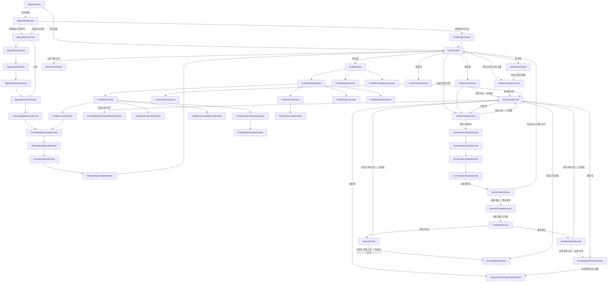

# 화면 목록 & 내비게이션 플로우

이 문서는 **현재 코드에 실제로 등록돼 있는 화면과 이동 경로**를 정리한 것입니다.
기준 파일은 `navigation/Screen.kt`(route 상수), `navigation/NavGraph.kt`(화면 등록),
`navigation/MainTabsPager.kt`(하단 탭 페이지)입니다. 이 문서와 코드가 다르면 **코드가 맞습니다.**

스크린 ID 네이밍 규칙은 [`CONVENTIONS.md`](CONVENTIONS.md)의 "6. 화면(Screen) 네이밍 규칙" 참고.

> **집계 기준**: 같은 화면의 상태 변형(로딩/빈 상태/선택 상태 등)은 하나의 Screen으로 구현합니다.
> route가 2개여도 같은 Composable을 쓰면 화면 1개로 셉니다(예: 약관 동의의 이메일용·소셜용 route).

---

## 앱 셸 구조

```
MainScreen
 └ NavGraph (NavHost, startDestination = splash)
     ├ 하단 탭 4개 route  →  전부 MainTabsPager 를 그림
     │    home / mission_list / archive_home / profile
     │    └ HorizontalPager 4페이지 (홈 · 미션 · 아카이브 · 프로필)
     └ 그 외 route  →  각자 단독 화면
 └ TqBottomBar (하단 네비게이션 바)
```

- **하단 네비게이션 4탭**: `홈` · `미션` · `아카이브` · `프로필` (`BottomNavItem.kt`).
  네 탭은 `HorizontalPager` 안의 페이지라 **좌우 스와이프로도 이동**합니다. 탭 route로 navigate하면 같은 페이저의 다른 페이지로 넘어갑니다.
- **하단 네비게이션 바가 보이는 route**: 4탭 + `mission_list_home` + `mission_detail` + `profile_badges` + `profile_recent_mission`.
  그 외 화면(대화·리포트·회원가입 등)은 하단 바 없이 단독으로 뜹니다.
- 바텀시트가 하단 바를 덮으면 시트 위치에 맞춰 바를 잘라내거나 숨깁니다(`MainScreen.kt`의 `overlaySheetTop`).

---

## A담당 (지니/전준호) — 진입 · 프로필 (27화면)

**진입 · 회원가입 · 온보딩**

| 화면 이름 | 스크린 ID | route | 진입 경로 |
| --- | --- | --- | --- |
| 스플래시 | SplashScreen | `splash` | 앱 최초 실행 |
| 로그인 / 시작 | SignupStartScreen | `login` | 스플래시 → 토큰 없음 |
| 이메일 로그인 | EmailLoginScreen | `email_login` | 로그인 → 이메일로 로그인 |
| 약관 동의 | SignupTermsScreen | `signup_terms` · `signup_terms_social` | 로그인 → 이메일로 시작하기 / 소셜 로그인(신규 유저) |
| 이메일 입력 | SignupEmailScreen | `signup_email` | 약관 동의 → 다음 |
| 이메일 인증 | SignupVerifyScreen | `signup_verify` | 이메일 입력 → 인증번호 전송 |
| 비밀번호 설정 | SignupPasswordScreen | `signup_password` | 이메일 인증 완료 |
| 닉네임 설정 | SignupNicknameScreen | `signup_nickname` · `signup_nickname_social` | 비밀번호 설정 후 / 소셜 약관 동의 후 |
| 온보딩 환영 | OnboardingWelcomeScreen | `onboarding_welcome` | 닉네임 설정 완료 |
| 온보딩 성향 선택 | OnboardingPersonalityScreen | `onboarding_personality` | 온보딩 환영 → 다음, 프로필 고민 수정 → 다시 설정 |
| 온보딩 어려운 상황 | OnboardingDifficultyScreen | `onboarding_difficulty` | 성향 선택 → 다음 |
| 온보딩 연습 목표 | OnboardingGoalScreen | `onboarding_goal` | 어려운 상황 선택 → 다음 |
| 온보딩 완료 | OnboardingCompleteScreen | `onboarding_complete` | 연습 목표 설정 → 완료 |

**프로필**

| 화면 이름 | 스크린 ID | route | 진입 경로 |
| --- | --- | --- | --- |
| 프로필 | ProfileScreen | `profile` (탭) | 하단 네비게이션 '프로필' 탭 |
| 뱃지 컬렉션 | ProfileBadgesScreen | `profile_badges` | 프로필 → 뱃지 영역 / 홈 뱃지 카드(페이저 안에서 프로필 페이지로 전환) |
| 최근 미션 | ProfileRecentMissionScreen | `profile_recent_mission` | 프로필 → 최근 미션 |
| 설정 | ProfileSettingsScreen | `profile_settings` | 프로필 → 설정 |
| 내 정보 | ProfileInfoScreen | `profile_info` | 설정 → 프로필 수정 |
| 닉네임 수정 | ProfileNicknameEditScreen | `profile_nickname_edit` | 내 정보 → 닉네임 |
| 비밀번호 확인 | ProfilePasswordChangeScreen | `profile_password_change` | 내 정보 → 비밀번호 변경 |
| 새 비밀번호 설정 | ProfileNewPasswordScreen | `profile_new_password` | 비밀번호 확인 성공 |
| 연결된 계정 | ProfileConnectedAccountScreen | `profile_connected_account` | 내 정보 → 연결된 계정 |
| 고민 수정 | ProfileConcernScreen | `profile_concern` | 내 정보 → 고민 |
| 약관 | ProfileTermsScreen | `profile_terms` | 설정 → 약관 |
| 약관 상세 | ProfileTermsDetailScreen | `profile_service_terms` · `profile_privacy_policy` | 약관 → 서비스 이용약관 / 개인정보 처리방침 |
| 고객센터 | ProfileSupportScreen | `profile_support` | 설정 → 고객센터 |
| 회원 탈퇴 | ProfileWithdrawScreen | `profile_withdraw` | 설정 → 회원 탈퇴 |

> 약관 상세는 서비스 이용약관·개인정보 처리방침이 route만 다르고 같은 Composable을 씁니다.
> 회원 탈퇴·연결된 계정 해제는 완료 후 `login`으로 돌아가며 `home`까지 백스택을 비웁니다.

---

## B담당 (이도/윤기수) — 홈 · 알림 · 미션 · AI 대화 · 리포트 (14화면)

| 화면 이름 | 스크린 ID | route | 진입 경로 |
| --- | --- | --- | --- |
| 홈 | HomeScreen | `home` (탭) | 로그인/온보딩 완료 후, 하단 네비게이션 '홈' 탭 |
| 알림 | NotificationScreen | `notification` | 홈 → 우측 상단 종 버튼 |
| 미션 목록 | MissionListScreen | `mission_list` (탭) · `mission_list_home` | 하단 '미션' 탭 / 홈 → 다른 미션 보기 |
| 미션 상세 | MissionDetailScreen | `mission_detail/{missionId}` | 홈 미션 카드, 미션 목록, 보관함 미션 항목 |
| 대화 설정 ① 장소 | ConversationSetup1Screen | `conversation_setup_1/{missionId}` | 미션 상세 → 미션 시작하기 |
| 대화 설정 ② 상대 | ConversationSetup2Screen | `conversation_setup_2/{missionId}` | ① → 다음 |
| 대화 설정 ③ 성별·나이 | ConversationSetup3Screen | `conversation_setup_3/{missionId}` | ② → 다음 |
| 대화 설정 ④ 친밀도·말투 | ConversationSetup4Screen | `conversation_setup_4/{missionId}` | ③ → 다음 |
| 대화하기 | ConversationScreen | `conversation/{conversationId}` | ④ → 다음 (6축 설정을 서버에 저장한 뒤 이동) |
| 미션 완료·XP | MissionCompleteScreen | `mission_complete/{missionId}?durationSec={durationSec}` | 대화하기 → "대화 완료" → 종료 확인 |
| AI 피드백 요약 | FeedbackScreen | `feedback/{feedbackId}` | 미션 완료 → 연출 종료 후 자동 전환 |
| AI 피드백 상세 | FeedbackDetailScreen | `feedback_detail/{feedbackId}?item={item}` | 피드백 요약 → 항목 4개 중 하나 클릭 (`item` = 항목 index) |
| 성장 리포트 | ReportScreen | `report?missionTitle={missionTitle}&conversationId={conversationId}&gains={gains}` | AI 피드백 요약 → 상세 리포트 |
| 주간 비교 리포트 | WeeklyCompareScreen | `weekly_compare?reportId={reportId}` | 홈 도착 모달 → 확인 / 알림 목록의 주간 리포트 알림 |

**흐름에서 알아둘 것**

- **대화 준비는 4단계 화면(`ConversationSetup1~4Screen`)입니다.** 네 화면이 `ConversationSetupViewModel` 하나를 공유하며(1단계 backStackEntry에 묶임), 4단계에서 "다음"을 누를 때 고른 6축을 `POST /missions/{missionId}/setups`로 저장하고 대화로 넘어갑니다. 저장이 실패해도 대화는 시작됩니다.
- **대화 진입 로딩**은 별도 route가 아니라 `ConversationScreen`의 로딩 상태(`ConversationIntroScreen`)로 그려집니다.
- **대화하기의 출구는 두 개**입니다. 헤더 뒤로가기 = 대화 포기(서버 대화를 `abandoned`로 닫고 홈으로), "대화 완료" = 종료 확인 팝업 → 미션 완료·XP.
- **미션 완료·XP → AI 피드백 요약은 완료 연출이 끝나면 자동 전환**됩니다. 연출 중 화면을 터치하면 남은 연출을 마친 뒤 즉시 넘어갑니다.
- **성장 리포트는 진입 시 파라미터 3개**를 받습니다. `missionTitle`(저장 시트 카드 제목), `conversationId`(`POST /reports` 저장용), `gains`(이번 대화에서 얻은 4축 점수, 마름모 꼭짓점 `+N` 표시용 쉼표 구분). 서버 성장 리포트 응답에 증가분이 없어 방금 그 값을 받은 피드백 화면이 넘겨줍니다.
- **성장 리포트와 주간 비교 리포트는 별개 화면**입니다. 성장 리포트는 피드백에서만 들어오고, 주간 비교 리포트는 주차 이동·자주 연습한 주제·미션 진행률이 있으며 홈 모달과 알림에서 들어옵니다.
- **리포트 화면에는 하단 네비게이션 바가 없습니다.** 뒤로가기로만 빠져나갑니다.
- **알림 화면에서 뒤로 나오면 홈이 새 알림 상태만 다시 조회**합니다(XP 복귀 모션과는 별개 신호).

---

## C담당 (훈/김재훈) — 아카이브 (7화면)

| 화면 이름 | 스크린 ID | route | 진입 경로 |
| --- | --- | --- | --- |
| 아카이브 홈 | ArchiveHomeScreen | `archive_home` (탭) | 하단 네비게이션 '아카이브' 탭 |
| 아카이브 검색 | ArchiveSearchScreen | `archive_search` | 아카이브 홈 → 검색 아이콘 |
| 보관함 목록 | ArchiveListScreen | `archive_list/{tabIndex}` | 아카이브 홈 → 카테고리, 저장 시트의 "보관함 >" |
| 대화 기록 상세 | ArchiveConversationDetailScreen | `archive_conversation_detail/{conversationId}` | 보관함 목록·검색·문장 상세 → 대화 항목 |
| 저장한 문장 상세 | ArchiveSavedPhraseScreen | `archive_saved_phrase/{phraseId}` | 보관함 목록·검색 → 문장 항목, AI 피드백 상세의 문장 저장 시트 |
| 보관함 성장 리포트 | ArchiveReportScreen | `archive_report/{reportId}` | 보관함 목록·검색 → 리포트 항목(주간 아님), 성장 리포트 저장 시트 |
| 보관함 주간 비교 리포트 | ArchiveWeeklyCompareReportScreen | `archive_weekly_compare_report/{reportId}` | 보관함 목록·검색 → 리포트 항목(주간) |

**보관함 목록 탭 index**

| index | 탭 | 항목 클릭 시 |
| --- | --- | --- |
| 0 | 미션 | `mission_detail/{missionId}` (B의 미션 상세를 그대로 씀) |
| 1 | 대화 | `archive_conversation_detail/{conversationId}` |
| 2 | 문장 | `archive_saved_phrase/{phraseId}` |
| 3 | 리포트 | 주간 여부에 따라 `archive_weekly_compare_report/…` 또는 `archive_report/…` |

> **보관함 미션 항목은 B의 `MissionDetailScreen`으로 들어갑니다.** 아카이브 전용 미션 상세 화면은 만들지 않고 B 화면을 재사용하는 구조로 정리됐습니다.
>
> **리포트 항목은 주간 여부로 갈라집니다.** 목록·검색 양쪽 모두 `isWeeklyCompare` 값을 보고 두 route 중 하나를 고릅니다.

> **커뮤니티(모임)는 구현하지 않기로 확정했습니다.** 부가 기능이라 디자인이 뒤로 밀렸고, 남은 일정을 보관함과 리포트 완성도에 쓰기로 했습니다.
> 화면·route·API·패키지 어느 것도 만들지 않았습니다. 이탈·게시 완료·탈퇴 팝업 4종도 함께 제외됩니다.

---

## 바텀시트 · 모달 · 팝업

별도 route를 만들지 않고 화면 위에 띄우는 UI입니다.

| 이름 | 뜨는 위치 | 나가는 곳 | 담당 |
| --- | --- | --- | --- |
| 미션 저장 시트 | 미션 목록 / 미션 상세 → 북마크 | 보관함 > → `archive_list/0` | B |
| 문장 저장 시트 | AI 피드백 상세 → 문장 저장 | 보관함 > → `archive_list/2`, 문장 보기 → 문장 상세 | B |
| 리포트 저장 시트 | 성장 리포트 → 리포트 저장하기 | 보관함 > → `archive_list/3`, 리포트 보기 → `archive_report/{id}` | B |
| 주간 리포트 도착 모달 | 홈 진입 시 새 주간 리포트가 있으면 자동 | 확인 → `weekly_compare?reportId=…` | B |
| 티어 승급 안내 시트 | 홈 (티어가 오른 상태로 진입) | 닫기 | B |
| 대화 종료 확인 팝업 | 대화하기 → "대화 완료" | 종료하기 → 미션 완료·XP | B |
| 성장 리포트 승급 연출 | 성장 리포트에서 마름모가 완성될 때 | 자동 종료 (화면 탭으로 다시 재생) | B |
| 보관함 정렬 시트 | 아카이브 검색·목록 → 정렬 | 선택 후 닫힘 | C |
| 보관함 달력 시트 | 아카이브 검색 → 기간 선택 | 선택 후 닫힘 | C |
| 보관함 리포트 시트 | 보관함 리포트 화면 | 선택 후 닫힘 | C |

> 저장 시트 3종(미션·문장·리포트)은 `core/designsystem`의 `TqSaveSheetScaffold` 하나를 공유합니다.
> 티어 승급 안내 시트도 `core/designsystem`에 있어(`TierPromotionSheet`) 다른 화면에서 가져다 쓸 수 있습니다.

---

## route 상수와 실제 등록이 어긋나는 곳

`Screen.kt`의 모든 상수는 실제로 등록된 화면을 가리킵니다. 다만 반대 방향으로 어긋난 곳이 있습니다.

| 대상 | 상태 |
| --- | --- |
| `ARCHIVE_CONVERSATION_DETAIL` · `ARCHIVE_SAVED_PHRASE` | 상수가 있는데 NavGraph는 같은 값의 문자열을 직접 씁니다. |
| `archive_report/{reportId}` · `archive_weekly_compare_report/{reportId}` | **상수 없이 NavGraph에 문자열로 직접 등록**돼 있습니다. |

route는 `Screen.kt`에 상수로 정의하고 NavGraph에서 그 상수를 쓰는 것이 규칙입니다([`CONVENTIONS.md`](CONVENTIONS.md) 6번). 위 네 곳은 정리 대상입니다.

> **대화 요약 화면(`ConversationCompleteScreen`)은 만들지 않았습니다.** 대화 종료 시 미션 완료·XP로 바로 넘어갑니다. 관련 route 상수도 두지 않습니다.

---

## 내비게이션 플로우


```mermaid
flowchart TD
    Splash[SplashScreen] -->|토큰 없음| Login[SignupStartScreen]
    Splash -->|토큰 있음| Home[HomeScreen]

    Login -->|이메일로 로그인| EmailLogin[EmailLoginScreen]
    EmailLogin --> Home
    Login -->|이메일로 시작하기| Terms[SignupTermsScreen]
    Login -->|소셜 신규 유저| Terms
    Terms --> SignupEmail[SignupEmailScreen]
    SignupEmail --> SignupVerify[SignupVerifyScreen]
    SignupVerify --> SignupPw[SignupPasswordScreen]
    SignupPw --> SignupNick[SignupNicknameScreen]
    Terms -->|소셜| SignupNick
    SignupNick --> OnboardWelcome[OnboardingWelcomeScreen]

    OnboardWelcome --> OnboardPersonality[OnboardingPersonalityScreen]
    OnboardPersonality --> OnboardDifficulty[OnboardingDifficultyScreen]
    OnboardDifficulty --> OnboardGoal[OnboardingGoalScreen]
    OnboardGoal --> OnboardComplete[OnboardingCompleteScreen]
    OnboardComplete --> Home

    Home -->|종 버튼| Notification[NotificationScreen]
    Home -->|주간 리포트 도착 모달| Weekly[WeeklyCompareScreen]
    Notification -->|주간 리포트 알림| Weekly
    Home -->|다른 미션 보기| MissionListHome[MissionListScreen]
    Home -->|오늘의 미션 카드| MissionDetail[MissionDetailScreen]
    MissionList[MissionListScreen] --> MissionDetail
    MissionDetail -->|미션 시작하기| Setup1[ConversationSetup1Screen]
    Setup1 --> Setup2[ConversationSetup2Screen]
    Setup2 --> Setup3[ConversationSetup3Screen]
    Setup3 --> Setup4[ConversationSetup4Screen]
    Setup4 -->|6축 저장 후| Conversation[ConversationScreen]
    Conversation -->|대화 완료 → 종료 확인| MissionComplete[MissionCompleteScreen]
    Conversation -->|뒤로가기 = 대화 포기| Home
    MissionComplete -->|연출 종료 후 자동| Feedback[FeedbackScreen]
    Feedback -->|항목 클릭| FeedbackDetail[FeedbackDetailScreen]
    Feedback -->|상세 리포트| Report[ReportScreen]

    MissionList -->|저장 시트 → 보관함| ArchiveList
    MissionDetail -->|저장 시트 → 보관함| ArchiveList
    FeedbackDetail -->|문장 저장 시트 → 보관함| ArchiveList
    FeedbackDetail -->|문장 저장 시트 → 문장 보기| ArchivePhrase
    Report -->|리포트 저장 시트 → 보관함| ArchiveList
    Report -->|리포트 저장 시트 → 리포트 보기| ArchiveReport
    Weekly -->|완료한 미션| ArchiveList

    Home -->|하단 탭| Archive[ArchiveHomeScreen]
    Home -->|하단 탭| MissionList
    Home -->|하단 탭| Profile[ProfileScreen]

    Archive --> ArchiveSearch[ArchiveSearchScreen]
    Archive --> ArchiveList[ArchiveListScreen]
    ArchiveList -->|미션 탭| MissionDetail
    ArchiveList -->|대화 탭| ArchiveConv[ArchiveConversationDetailScreen]
    ArchiveList -->|문장 탭| ArchivePhrase[ArchiveSavedPhraseScreen]
    ArchiveList -->|리포트 탭·성장| ArchiveReport[ArchiveReportScreen]
    ArchiveList -->|리포트 탭·주간| ArchiveWeekly[ArchiveWeeklyCompareReportScreen]
    ArchivePhrase -->|이 문장이 나온 대화| ArchiveConv

    Profile --> ProfileBadges[ProfileBadgesScreen]
    Profile --> ProfileRecent[ProfileRecentMissionScreen]
    Profile --> ProfileSettings[ProfileSettingsScreen]
    ProfileSettings --> ProfileInfo[ProfileInfoScreen]
    ProfileSettings --> ProfileTerms[ProfileTermsScreen]
    ProfileSettings --> ProfileSupport[ProfileSupportScreen]
    ProfileSettings --> ProfileWithdraw[ProfileWithdrawScreen]
    ProfileInfo --> ProfileNickname[ProfileNicknameEditScreen]
    ProfileInfo --> ProfilePw[ProfilePasswordChangeScreen]
    ProfilePw --> ProfileNewPw[ProfileNewPasswordScreen]
    ProfileInfo --> ProfileAccount[ProfileConnectedAccountScreen]
    ProfileInfo --> ProfileConcern[ProfileConcernScreen]
    ProfileConcern --> OnboardPersonality
    ProfileTerms --> ProfileTermsDetail[ProfileTermsDetailScreen]
```
